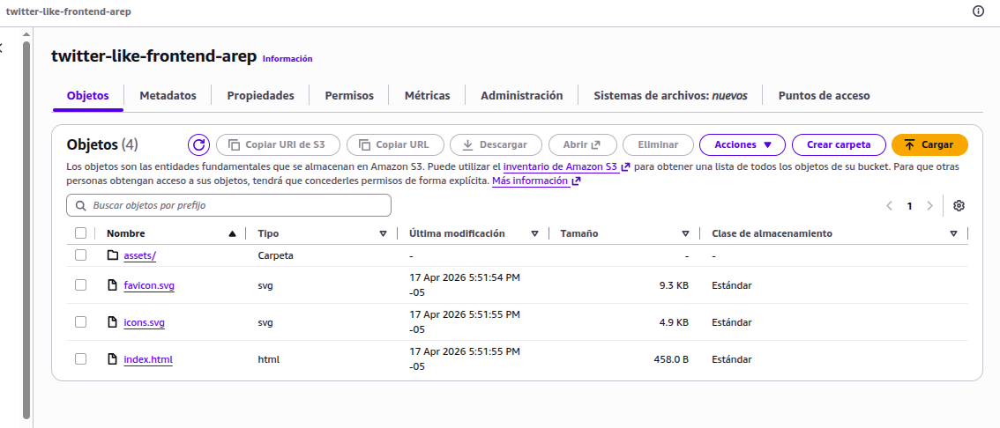
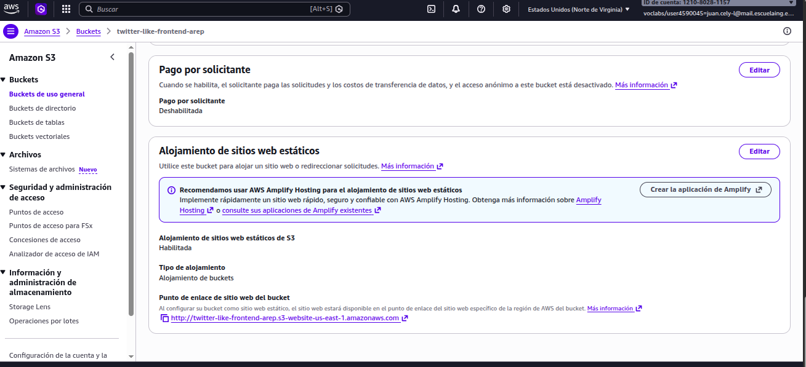
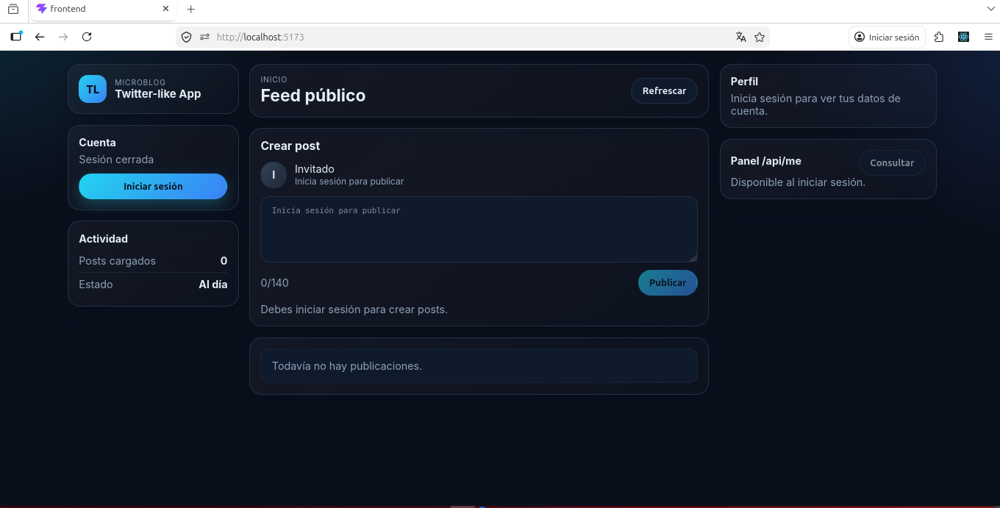
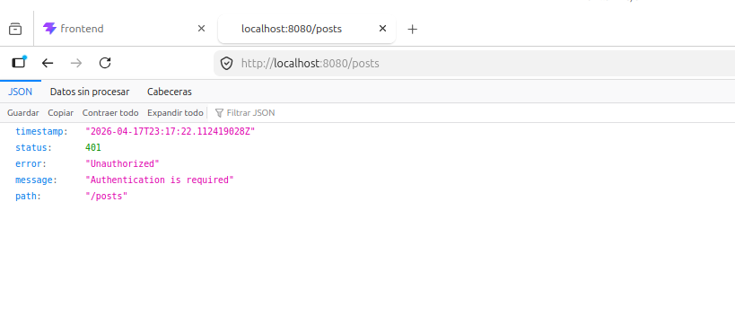
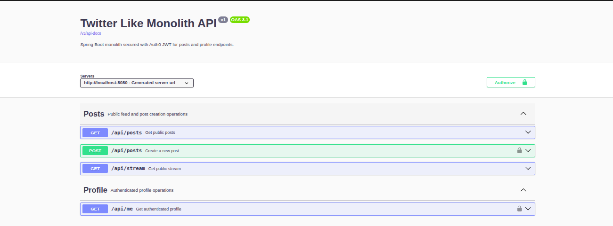
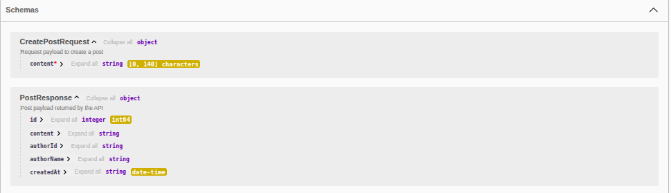
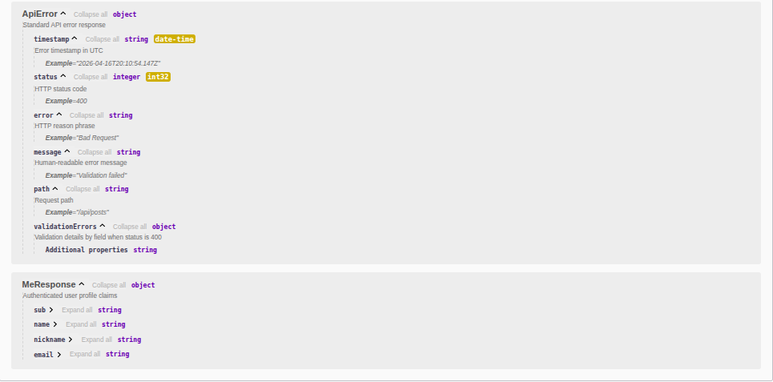
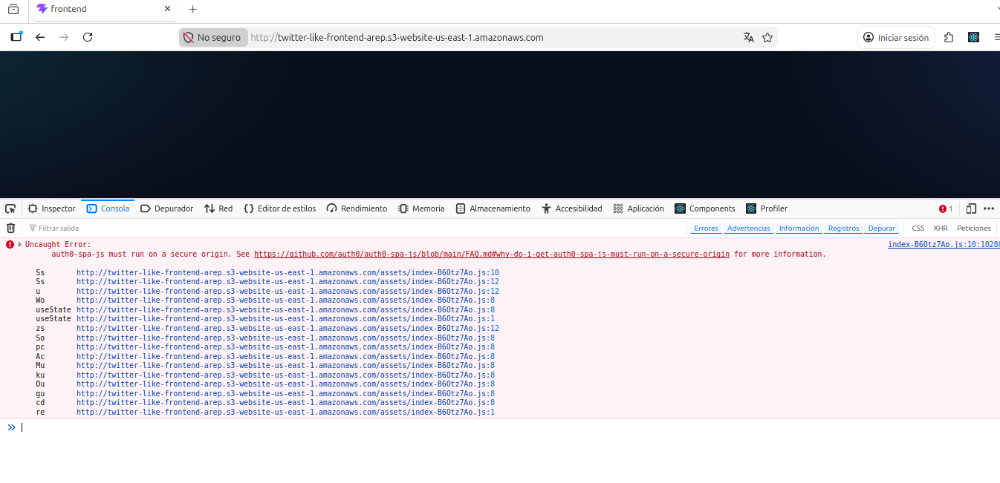

# Twitter-like Application

A simplified Twitter-like application where authenticated users can publish posts (max 140 characters) into a public feed.

The repository is organized as a monorepo and currently focuses on the **Spring Boot monolith phase** with a **React + Vite frontend**, fully secured with **Auth0**.

## Current Architecture

- **Backend:** Spring Boot 3.4 (Java 21), JPA, Security, OAuth2 Resource Server, OpenAPI
- **Frontend:** React 19 + Vite 8 + Auth0 SPA SDK
- **Default database for demo/dev:** H2 in-memory
- **Optional database profile:** PostgreSQL via Docker Compose profile
- **Container orchestration:** Docker Compose (root-level)

## Repository Structure

```text
.
├── docker-compose.yml
├── .env.example
├── frontend/                    # React + Vite SPA (served with nginx in Docker)
│   ├── Dockerfile
│   ├── nginx.conf
│   └── src/
├── monolith/
│   └── TwitterBackend/          # Spring Boot monolith
│       ├── Dockerfile
│       └── src/main/java/edu/eci/co/
│           ├── config/
│           ├── controller/
│           ├── service/
│           ├── repository/
│           ├── entity/
│           └── dto/
├── serverless/                  # Future phase
└── docs/
```

## Backend (Spring Boot Monolith)

**Path:** `monolith/TwitterBackend`

Key points:
- Exposes API on port `8080`
- Public endpoints: `GET /api/posts`, `GET /api/stream`
- Protected endpoints:
  - `POST /api/posts` requires `write:posts`
  - `GET /api/me` requires `read:profile`
- Auth0 JWT validation through:
  - `AUTH0_ISSUER_URI`
  - `AUTH0_AUDIENCE`
- CORS configured via `APP_CORS_ALLOWED_ORIGINS`
- Supports H2 (default) and PostgreSQL (runtime driver included)

## Frontend (React + Vite)

**Path:** `frontend`

Key points:
- Served on port `5173` (mapped to nginx container port `80`)
- Uses Auth0 SPA integration
- Calls backend through `/api/*`
- In Docker, nginx proxies `/api` to `backend:8080`
- SPA fallback is enabled in nginx (`try_files ... /index.html`)

## Run on Another PC with Docker (Recommended)

### 1. Prerequisites

- Docker Engine / Docker Desktop
- Docker Compose
- Git

### 2. Clone and prepare environment file

```bash
git clone https://github.com/Juan-cely-l/-Twitter-like-Application.git
cd -Twitter-like-Application
cp .env.example .env
```

### 3. Configure `.env`

Update `.env` with your Auth0 values (minimum required):

```env
VITE_AUTH0_DOMAIN=your-tenant.us.auth0.com
VITE_AUTH0_CLIENT_ID=your_auth0_spa_client_id
VITE_AUTH0_AUDIENCE=https://twitter-like-api
AUTH0_ISSUER_URI=https://your-tenant.us.auth0.com/
AUTH0_AUDIENCE=https://twitter-like-api
```

Full variable reference:

| Variable | Used by | Required | Default | Purpose |
| --- | --- | --- | --- | --- |
| `VITE_AUTH0_DOMAIN` | Frontend build | Yes | - | Auth0 tenant domain for SPA login |
| `VITE_AUTH0_CLIENT_ID` | Frontend build | Yes | - | Auth0 SPA client ID |
| `VITE_AUTH0_AUDIENCE` | Frontend build | Yes | - | API audience requested by SPA |
| `VITE_API_BASE_URL` | Frontend build | No | empty | Keep empty to use nginx proxy (`/api`) |
| `AUTH0_ISSUER_URI` | Backend runtime | Yes | project demo value | JWT issuer for resource server |
| `AUTH0_AUDIENCE` | Backend runtime | Yes | project demo value | JWT audience expected by backend |
| `APP_CORS_ALLOWED_ORIGINS` | Backend runtime | No | `http://localhost:5173` | Allowed browser origins |
| `FRONTEND_PORT` | Docker Compose | No | `5173` | Host port for frontend |
| `BACKEND_PORT` | Docker Compose | No | `8080` | Host port for backend |
| `POSTGRES_DB` | PostgreSQL profile | No | `twitterdb` | Database name |
| `POSTGRES_USER` | PostgreSQL profile | No | `twitter` | Database user |
| `POSTGRES_PASSWORD` | PostgreSQL profile | No | `twitter` | Database password |
| `POSTGRES_PORT` | PostgreSQL profile | No | `5432` | Host port for PostgreSQL |
| `SPRING_DATASOURCE_URL` | Backend runtime | No | H2 memory URL | Set only when using PostgreSQL |
| `SPRING_DATASOURCE_DRIVER_CLASS_NAME` | Backend runtime | No | `org.h2.Driver` | Set `org.postgresql.Driver` for PostgreSQL |
| `SPRING_DATASOURCE_USERNAME` | Backend runtime | No | `sa` | Datasource username |
| `SPRING_DATASOURCE_PASSWORD` | Backend runtime | No | empty | Datasource password |
| `SPRING_JPA_HIBERNATE_DDL_AUTO` | Backend runtime | No | `update` | Schema strategy |

Important notes to avoid confusion:
- `VITE_*` variables are used at **frontend build time**. If you change any `VITE_*` value, run Docker again with `--build`.
- Keep `VITE_API_BASE_URL=` empty to use nginx reverse proxy (`/api -> backend`).
- `APP_CORS_ALLOWED_ORIGINS` controls allowed browser origins for backend CORS.

### 4. Build and start all services

```bash
docker compose up --build
```

Detached mode:

```bash
docker compose up --build -d
```

### 5. Access the application

- Frontend: `http://localhost:5173`
- Backend API: `http://localhost:8080`
- Swagger UI: `http://localhost:8080/swagger-ui.html`

### 6. Stop services

```bash
docker compose down
```

### 7. Optional: run with PostgreSQL profile

By default, the project uses H2 for fast demo/development.

To use PostgreSQL:
1. Uncomment and set `SPRING_DATASOURCE_*` values in `.env` (already provided as examples).
2. Start with PostgreSQL profile:

```bash
docker compose --profile postgres up --build
```

## Local Development Without Docker

### Backend

```bash
cd monolith/TwitterBackend
mvn spring-boot:run
```

### Frontend

```bash
cd frontend
npm ci
npm run dev
```

## AWS S3 Static Website Deployment Evidence

The frontend was prepared as a static Vite build and uploaded to an Amazon S3 bucket configured for static website hosting. The backend is intentionally kept local for this delivery, because the assignment requires the frontend to be publicly available on S3 but does not require backend deployment.

| Item | Value |
| --- | --- |
| Static frontend hosting | Amazon S3 Static Website Hosting |
| S3 website endpoint | `http://twitter-like-frontend-arep.s3-website-us-east-1.amazonaws.com` |
| Local backend URL | `http://localhost:8080` |
| Swagger UI | `http://localhost:8080/swagger-ui.html` |
| Auth0 API audience | `https://twitter-like-api` |

### S3 Bucket Configuration

The S3 bucket `twitter-like-frontend-arep` was created to host the frontend static assets generated by the Vite production build.



Static website hosting was enabled in the bucket properties. The website entry point is `index.html`, which allows the React single page application to be served from the S3 website endpoint.



### Public Frontend Result

The uploaded frontend is publicly reachable through the S3 website endpoint. The frontend build is configured to call the local backend at `http://localhost:8080`, which matches the current assignment scope where only the frontend is deployed publicly.



### Local Backend Evidence

The Spring Boot monolith runs locally on port `8080`. Public endpoints such as `GET /api/posts` can be used without authentication, while protected endpoints require a valid Auth0 JWT access token and the expected scopes.



### Swagger and API Documentation Evidence

Swagger UI is available from the local backend and documents the REST API, request and response models, and JWT Bearer security requirements.



The API documentation includes the public post stream endpoints and the protected post creation endpoint.



The protected user profile endpoint `GET /api/me` is also documented and requires a valid JWT with the expected profile scope.



## CloudFront HTTPS Mitigation

Amazon S3 Static Website Hosting exposes the site through an HTTP endpoint. This is enough to make the frontend publicly accessible, but it creates an important limitation for Auth0: the Auth0 React SDK uses the SPA flow with PKCE and requires a secure browser origin. In modern browsers, a public HTTP S3 website endpoint is not considered a secure origin.

The correct mitigation is to place Amazon CloudFront in front of the S3 static website and serve the same frontend through HTTPS. The intended CloudFront setup is:

| Setting | Intended value |
| --- | --- |
| Origin | `twitter-like-frontend-arep.s3-website-us-east-1.amazonaws.com` |
| Viewer protocol policy | Redirect HTTP to HTTPS |
| Default root object | `index.html` |
| Custom error response `403` | `/index.html` with HTTP `200` |
| Custom error response `404` | `/index.html` with HTTP `200` |
| Auth0 callback/logout/web origin | `https://<cloudfront-distribution-domain>` |
| Backend CORS origin | `https://<cloudfront-distribution-domain>` |

CloudFront distribution creation was attempted, but the AWS VocLabs role assigned to the account does not include the required `cloudfront:CreateDistribution` permission. Because this is an identity-based permission restriction, it cannot be solved from the application code or S3 configuration.



If CloudFront permissions are enabled by the lab environment, the same uploaded S3 frontend can be served through HTTPS without changing the application source code. The Auth0 application settings and backend `APP_CORS_ALLOWED_ORIGINS` value must then be updated to include the CloudFront HTTPS domain.

## API Summary

| Endpoint | Method | Access |
| --- | --- | --- |
| `/api/posts` | GET | Public |
| `/api/stream` | GET | Public |
| `/api/posts` | POST | JWT + `write:posts` |
| `/api/me` | GET | JWT + `read:profile` |

## Testing and Validation

### Backend tests

```bash
cd monolith/TwitterBackend
mvn test
```

Current integration suite coverage includes:
- 15 integration tests
- Security and scope enforcement
- Validation constraints (including 140-char limit)
- Functional persistence behavior

### Frontend checks

```bash
cd frontend
npm run build
npm run lint
```

## License

This project is distributed under the terms of the `LICENSE` file in the repository root.
