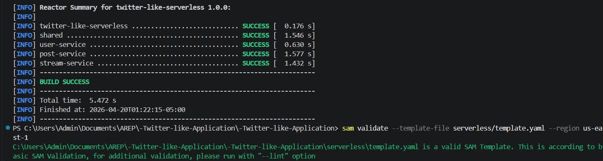
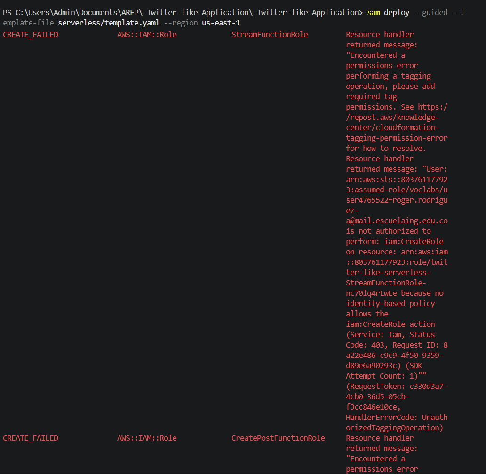

# Twitter-like Application

A simplified Twitter-like application where authenticated users can publish short posts, up to 140 characters, into a single public feed.

## Video Demonstration

- Full demo: https://youtu.be/_mGzmxOVIpo

## Authors

- Roger Alexander Rodriguez Abril
- Juan Esteban Cely

The project is organized as a monorepo with two backend phases:

- A Spring Boot monolith used as the initial implementation.
- A serverless AWS migration that splits the monolith into independent Java Lambda microservices.

## Architecture Overview

The application starts as a Spring Boot monolith and evolves into serverless microservices on AWS, as required by the assignment.

```text
Local and monolith phase

React + Vite SPA
   |
   v
Spring Boot monolith
   |
   |-- GET  /api/posts
   |-- GET  /api/stream
   |-- POST /api/posts
   |-- GET  /api/me
   |
   v
H2 or PostgreSQL
```

```text
Serverless AWS phase

React + Vite SPA hosted on S3 or CloudFront
   |
   v
Amazon API Gateway HTTP API
   |
   |-- GET  /api/me      -> user-service Lambda
   |-- POST /api/posts   -> post-service Lambda
   |-- GET  /api/posts   -> stream-service Lambda
   |-- GET  /api/stream  -> stream-service Lambda
   |
   v
Amazon DynamoDB Posts table
```

Auth0 is the identity provider for both phases. The frontend obtains Auth0 access tokens, and protected backend endpoints require JWT Bearer tokens with the expected audience and scopes.

## Domain Model

The assignment mentions `User`, `Post`, and `Stream`. The project models them as follows:

| Concept | Implementation |
| --- | --- |
| User | Managed externally by Auth0. The backend reads the authenticated user identity from JWT claims and does not store credentials. |
| Post | Application-owned data. The monolith persists posts with JPA; the serverless phase stores posts in DynamoDB. |
| Stream | A single global public feed. It is exposed as `/api/stream` and computed by reading posts ordered by creation time. No separate stream table is required because there is only one stream. |

This keeps identity in Auth0, keeps posts in the application storage layer, and keeps the global stream as a REST resource.

## Repository Structure

```text
.
|-- docker-compose.yml
|-- .env.example
|-- frontend/                         # React + Vite SPA
|-- monolith/
|   `-- TwitterBackend/               # Spring Boot monolith
`-- serverless/
    |-- template.yaml                 # AWS SAM infrastructure
    |-- pom.xml                       # Maven multi-module build
    |-- shared/                       # Shared DTOs and helper utilities
    |-- user-service/                 # GET /api/me Lambda
    |-- post-service/                 # POST /api/posts Lambda
    `-- stream-service/               # GET /api/posts and GET /api/stream Lambda
```

## Spring Boot Monolith

Path:

```bash
monolith/TwitterBackend
```

Main characteristics:

- Java 21 and Spring Boot 3.4.
- Spring Security OAuth2 Resource Server.
- Auth0 JWT issuer and audience validation.
- JPA persistence with H2 by default and PostgreSQL available through Docker Compose.
- OpenAPI documentation through Swagger UI.

Monolith endpoints:

| Endpoint | Method | Access |
| --- | --- | --- |
| `/api/posts` | GET | Public |
| `/api/stream` | GET | Public |
| `/api/posts` | POST | JWT with `write:posts` |
| `/api/me` | GET | JWT with `read:profile` |

Swagger UI:

```text
http://localhost:8080/swagger-ui.html
```

## Serverless Microservices

Path:

```bash
serverless
```

The serverless implementation uses Java Lambda handlers instead of Spring Boot applications. This is the natural AWS Lambda migration because API Gateway handles HTTP routing and JWT authorization, while each Lambda owns one small business capability.

### user-service

Endpoint:

```http
GET /api/me
```

Responsibility:

- Requires a valid Auth0 JWT with `read:profile`.
- Reads the authenticated user claims provided by API Gateway.
- Returns `sub`, `name`, `nickname`, and `email`.

Main handler:

```text
serverless/user-service/src/main/java/edu/eci/co/users/UserHandler.java
```

### post-service

Endpoint:

```http
POST /api/posts
```

Responsibility:

- Requires a valid Auth0 JWT with `write:posts`.
- Validates that the post content is not blank.
- Enforces the 140-character limit.
- Stores the post in DynamoDB.
- Returns the created post.

Main handler:

```text
serverless/post-service/src/main/java/edu/eci/co/posts/CreatePostHandler.java
```

### stream-service

Endpoints:

```http
GET /api/posts
GET /api/stream
```

Responsibility:

- Publicly reads the global stream.
- Queries DynamoDB by the fixed `streamId` value `global`.
- Returns posts ordered by creation time descending.

Main handler:

```text
serverless/stream-service/src/main/java/edu/eci/co/stream/GetStreamHandler.java
```

## Serverless Data Model

The AWS phase uses a DynamoDB table created by `serverless/template.yaml`.

| Attribute | Purpose |
| --- | --- |
| `streamId` | Partition key. Always `global` for the single public stream. |
| `postKey` | Sort key. Combines `createdAt` and `postId` for descending feed reads and uniqueness. |
| `postId` | Public post identifier. |
| `content` | Post text, limited to 140 characters. |
| `authorId` | Auth0 subject from the JWT. |
| `authorName` | Display name resolved from Auth0 claims. |
| `createdAt` | UTC creation timestamp. |

## Auth0 Security

Auth0 configuration required by both phases:

| Auth0 item | Required value |
| --- | --- |
| SPA application | Used by the React frontend. |
| API audience | `https://twitter-like-api` or the value configured in the project environment. |
| Issuer | `https://YOUR-DOMAIN.auth0.com/` |
| Scopes | `write:posts`, `read:profile`, and optionally `read:posts`. |

The monolith validates JWTs with Spring Security. The serverless phase validates JWTs at API Gateway through the SAM HTTP API JWT authorizer.

Protected serverless routes:

| Endpoint | Required scope |
| --- | --- |
| `POST /api/posts` | `write:posts` |
| `GET /api/me` | `read:profile` |

Public serverless routes:

| Endpoint | Access |
| --- | --- |
| `GET /api/posts` | Public |
| `GET /api/stream` | Public |

## Frontend

Path:

```bash
frontend
```

Main characteristics:

- React 19 and Vite.
- Auth0 React SDK.
- Login and logout.
- Silent token retrieval through the Auth0 SDK.
- Public feed reading.
- Authenticated post creation.
- Authenticated `/api/me` request.

Important build-time variables:

```env
VITE_AUTH0_DOMAIN=your-tenant.us.auth0.com
VITE_AUTH0_CLIENT_ID=your_auth0_spa_client_id
VITE_AUTH0_AUDIENCE=https://twitter-like-api
VITE_API_BASE_URL=https://your-api-gateway-url
```

For the Docker Compose monolith flow, `VITE_API_BASE_URL` can stay empty so nginx proxies `/api` to the backend container. For the AWS serverless flow, set `VITE_API_BASE_URL` to the API Gateway output URL.

## Environment Variables

Copy the example file before running locally:

```bash
cp .env.example .env
```

Minimum local values:

```env
VITE_AUTH0_DOMAIN=your-tenant.us.auth0.com
VITE_AUTH0_CLIENT_ID=your_auth0_spa_client_id
VITE_AUTH0_AUDIENCE=https://twitter-like-api
AUTH0_ISSUER_URI=https://your-tenant.us.auth0.com/
AUTH0_AUDIENCE=https://twitter-like-api
APP_CORS_ALLOWED_ORIGINS=http://localhost:5173
```

Do not commit real Auth0 secrets or local `.env` files.

## Local Development With Docker

Build and run the monolith and frontend:

```bash
docker compose up --build
```

Access:

```text
Frontend: http://localhost:5173
Backend API: http://localhost:8080
Swagger UI: http://localhost:8080/swagger-ui.html
```

Run with PostgreSQL:

```bash
docker compose --profile postgres up --build
```

## Local Development Without Docker

Backend:

```bash
cd monolith/TwitterBackend
mvn spring-boot:run
```

Frontend:

```bash
cd frontend
npm ci
npm run dev
```

## Build And Deploy The Serverless Phase

Prerequisites:

- Java 21.
- Maven.
- AWS CLI configured for the target account.
- AWS SAM CLI.
- Auth0 tenant and API configured with the expected audience and scopes.

Build the Lambda artifacts:

```bash
mvn -f serverless/pom.xml clean package
```

Build the SAM application:

```bash
sam build --template-file serverless/template.yaml
```

Deploy:

```bash
sam deploy --guided \
  --parameter-overrides \
  Auth0Issuer=https://your-tenant.us.auth0.com/ \
  Auth0Audience=https://twitter-like-api \
  AllowedCorsOrigin=https://your-frontend-origin \
  Auth0ClaimsNamespace=https://twitter-like-app.example.com
```

After deployment, use the `ApiUrl` output as the frontend `VITE_API_BASE_URL` and rebuild the frontend.

## Frontend Deployment To S3

Build the frontend for the deployed API:

```bash
cd frontend
npm ci
npm run build
```

Upload `frontend/dist` to an S3 bucket configured for static website hosting.

For a production-like Auth0 flow, prefer serving the S3 site through CloudFront with HTTPS. S3 static website endpoints are HTTP-only, and Auth0 browser applications should use secure origins for public deployments.

Existing S3 deployment evidence is kept in the `Assets/` directory:

```text
Assets/S3bucket1.png
Assets/s3BucketconStaticWebsiteHostinghabilitado.png
Assets/Frontend1.png
Assets/ErrorBucketS3.png
Assets/sam_validate_template.png
Assets/sam_deploy_Created_Failed_AWS_IAM_Role.png
```

SAM deployment limitation evidence (VocLabs IAM restrictions):




## Testing And Validation

Run monolith integration tests:

```bash
cd monolith/TwitterBackend
mvn test
```

Run frontend checks:

```bash
cd frontend
npm run lint
npm run build
```

Build serverless services:

```bash
mvn -f serverless/pom.xml clean package
```

Recommended end-to-end checks after AWS deployment:

```bash
curl https://your-api-gateway-url/api/posts
curl https://your-api-gateway-url/api/stream
curl -H "Authorization: Bearer ACCESS_TOKEN" https://your-api-gateway-url/api/me
curl -X POST https://your-api-gateway-url/api/posts \
  -H "Authorization: Bearer ACCESS_TOKEN" \
  -H "Content-Type: application/json" \
  -d '{"content":"Hello from Lambda"}'
```

Also verify that `POST /api/posts` fails without a token and fails with a token that does not include `write:posts`.

## Assignment Coverage

| Requirement | Current implementation |
| --- | --- |
| Spring Boot monolith | Implemented in `monolith/TwitterBackend`. |
| REST API for 140-character posts | Implemented in the monolith and migrated to Lambda. |
| Single public stream | Implemented as `/api/stream` and `/api/posts`. |
| Swagger/OpenAPI | Implemented in the Spring Boot monolith. |
| React frontend | Implemented in `frontend`. |
| Auth0 SPA integration | Implemented with Auth0 React SDK. |
| Auth0 Resource Server security | Implemented in the monolith and modeled in API Gateway for serverless. |
| Protected `/api/me` | Implemented in the monolith and in `user-service`. |
| Three microservices | Implemented under `serverless/user-service`, `serverless/post-service`, and `serverless/stream-service`. |
| AWS Lambda deployment | Defined in `serverless/template.yaml` through AWS SAM. |
| API Gateway | Defined in `serverless/template.yaml`. |
| DynamoDB persistence for serverless | Defined in `serverless/template.yaml`. |
| S3 static frontend | Frontend is buildable for S3; existing deployment evidence is in `Assets/`. |

## Environment Limitation

AWS deployment could not be completed due to AWS Academy (VocLabs) restrictions, specifically missing permissions to execute `iam:CreateRole`.

The project is fully functional locally and ready to be deployed in an AWS account without those restrictions.

## License

This project is distributed under the terms of the `LICENSE` file in the repository root.
